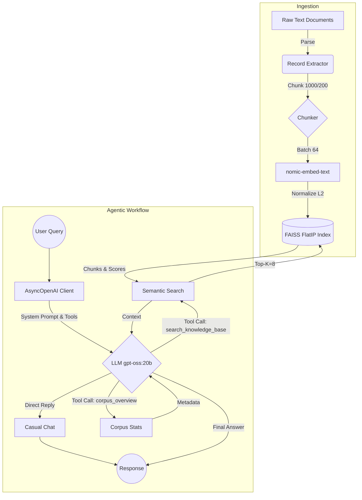

# Enterprise RAG CLI Architecture

> **Enterprise Retrieval-Augmented Generation system powered by local LLMs, FAISS, and Native Function Calling.**

This repository contains the implementation of a sophisticated, locally-hosted Retrieval-Augmented Generation (RAG) agent. Designed for enterprise environments requiring strict data privacy, it leverages local models via Ollama while adhering to modern architectural patterns like native function calling (OpenAI spec) for intent routing.

## 📌 Project Overview

The primary objective of this project is to build an intelligent, context-aware command-line assistant. Unlike basic RAG pipelines that force all queries through a retrieval step, this agent utilizes **Agentic Function Calling**. The model intelligently determines whether to engage in casual conversation, query the knowledge base for specific facts, or summarize the entire document corpus based solely on the user's prompt. 

## ✨ Features

- **Agentic Intent Routing**: The LLM autonomously decides when to trigger retrieval tools vs. responding directly.
- **Local Execution**: 100% local inference utilizing Ollama, ensuring zero data leakage.
- **Semantic Search**: High-performance vector retrieval utilizing FAISS (Facebook AI Similarity Search).
- **Asynchronous Execution**: Built on `asyncio` and `AsyncOpenAI` for concurrent embedding generation and non-blocking I/O.
- **Smart Chunking**: Custom text splitter with metadata preservation and configurable overlap.
- **Document Telemetry**: Dedicated `corpus_overview` tool to extract aggregate figures and document counts natively.

## 🏗️ Architecture

The system operates on a dual-flow architecture: **Ingestion** and **Retrieval/Generation**.



## 🛠️ Technology Stack

| Component | Technology | Rationale |
| :--- | :--- | :--- |
| **Language** | Python 3.x | Industry standard for AI/ML pipelines. |
| **Vector Database** | `faiss-cpu` | Extremely fast, in-memory similarity search library optimized for dense vectors. |
| **LLM Engine** | Ollama | Simplifies local model management and serving. |
| **API Client** | `openai` (Async) | Enables standard function calling schemas and asynchronous network requests. |
| **Math Library** | `numpy` | High-performance vector normalization for cosine similarity calculation. |
| **Generative Model** | `gpt-oss:20b` | Robust parameter model capable of strict instruction following and JSON tool emission. |
| **Embedding Model**| `nomic-embed-text`| 768-dimensional model highly optimized for semantic text representation. |

## ✂️ Chunking Strategy

Documents are processed using a sliding window chunking algorithm.

- **Chunk Size**: `1000` characters. Provides sufficient context for the LLM to synthesize complete answers.
- **Chunk Overlap**: `200` characters. Prevents context loss across chunk boundaries, ensuring semantic continuity.
- **Metadata Tagging**: Each chunk is prepended with its parent document title (`[Title]\n`). This crucial step ensures the LLM retains structural awareness of the source material even when chunks are retrieved out of order.

## 🧬 Embedding Strategy

- **Model**: `nomic-embed-text`
- **Dimensions**: `768`
- **Normalization**: Vectors are strictly L2-normalized `(mat / norm(mat))`. 
- **Prefixing**: Employs task-specific prefixes (`search_document: ` for ingestion, `search_query: ` for retrieval) to align the embedding space according to the Nomic model's requirements.
- **Batching**: Embeddings are processed in batches of `64` to maximize throughput without overwhelming local VRAM.

## 🗄️ Vector Database Design

The system implements `faiss.IndexFlatIP(EMBED_DIM)`. 
Because all embeddings are L2-normalized prior to insertion, the Inner Product (FlatIP) calculation mathematically equates to **Cosine Similarity**. This approach is computationally cheaper than calculating Euclidean distance (`IndexFlatL2`) while yielding superior ranking for semantic text matching. 
Chunks, sources, and document titles are stored in parallel Python lists, with their indices perfectly aligned to the FAISS vector IDs.

## 🔍 Retrieval Workflow

1. **Query Formulation**: The raw user query is embedded using the `search_query: ` prefix.
2. **Similarity Search**: FAISS executes an exhaustive inner product search against the index.
3. **Top-K Selection**: The system retrieves the top `8` most relevant chunks.
4. **Context Assembly**: Hits are formatted with their relevance score, rank, and source path, then injected back to the LLM via a standard OpenAI `tool` response message.

## 🛡️ Hallucination Prevention

Strict safeguards are enforced at the system-prompt level to prevent hallucination:
- **Restriction**: *"answer ONLY from tool results. Cite the source."*
- **Honesty**: *"If a tool returns no useful result, say so honestly and suggest the user rephrase..."*
- **Temperature**: The generation temperature is locked at `0.2`, suppressing creative deviation in favor of deterministic, factual extraction.

## 📂 Project Structure

```text
d:\New folder\New folder\
└── main/
    ├── KKE-Lab-Agent.py    # Main asynchronous agent script containing the RAG logic
    └── dataset.txt         # Raw text corpus formatted with === DOCUMENT START === delimiters
```

## 🚀 Installation

Ensure you have a machine with sufficient RAM/VRAM to run a 20B parameter model.

1. **Install Ollama**: Follow instructions at [ollama.com](https://ollama.com).
2. **Pull Required Models**:
   ```bash
   ollama pull gpt-oss:20b
   ollama pull nomic-embed-text
   ```
3. **Install Python Dependencies**:
   ```bash
   pip install openai faiss-cpu numpy
   ```

## 💻 Usage

Start the Ollama server in a separate terminal if it is not already running.
Launch the agent by passing the target dataset as a command-line argument:

```bash
cd main
python KKE-Lab-Agent.py dataset.txt
```

You will see the ingestion progress, followed by a `you>` prompt.

## 🗣️ Sample Queries

1. **General Chat (No Tool Call)**: *"Hello, what can you do?"*
2. **Knowledge Retrieval (search_knowledge_base)**: *"What are the key policies regarding remote work in the employee handbook?"*
3. **Corpus Overview (corpus_overview)**: *"How many documents are currently indexed in your database?"*

## 📄 Retrieved Chunks Example

When a retrieval occurs, the system internally surfaces context formatted as follows:

```text
[1] source=dataset.txt :: Employee Handbook (score=0.892)
[Employee Handbook]
Remote work is permitted for all tier-2 employees up to 3 days a week. Core hours are 10 AM to 3 PM EST.

[2] source=dataset.txt :: IT Security Policy (score=0.745)
[IT Security Policy]
When working remotely, employees must connect via the enterprise VPN to access internal services.
```

## 📝 Sample Answers

**User**: *"Can tier-2 employees work remotely?"*
**Agent**: *"Yes, according to the Employee Handbook (dataset.txt), tier-2 employees are permitted to work remotely for up to 3 days a week. However, please note that core working hours of 10 AM to 3 PM EST apply, and you must use the enterprise VPN to access internal services (IT Security Policy)."*

## ⚠️ Limitations

- **In-Memory Storage**: The FAISS index is completely ephemeral. It must be rebuilt upon every application restart.
- **Format Support**: Currently, the custom parser only understands specific delimited `.txt` files.
- **Resource Intensity**: Running a 20B model locally requires substantial hardware (approx. 16GB-24GB VRAM/RAM depending on quantization).

## 🔮 Future Improvements

- **Persistent Storage**: Migrate from in-memory FAISS to a persistent vector store like ChromaDB, Qdrant, or PGVector.
- **Advanced Retrieval**: Implement Hybrid Search (combining dense vector search with sparse BM25 keyword search) for better exact-match performance.
- **Reranking Phase**: Introduce a cross-encoder model (e.g., `bge-reranker`) to re-score and re-order the Top-K chunks before feeding them to the LLM.
- **Broader Ingestion**: Add `PyPDF2` or `unstructured` to parse PDFs, Word documents, and HTML files.
